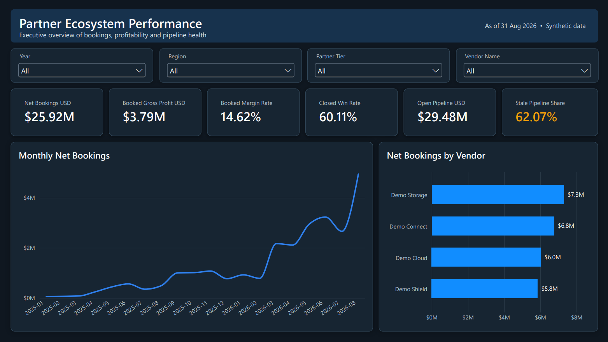

# Partner Ecosystem Performance Analytics

An end-to-end data analytics project that transforms synthetic CRM opportunity data into validated business metrics, a relational analytics model, and a four-page Power BI dashboard.

The solution combines **Python**, **SQL**, **SQLite**, **DAX**, **Power Query**, and **Power BI** to analyze partner contribution, profitability, pipeline health, and opportunity outcomes.

> All organizations, partners, vendors, opportunities, and financial values in this project are synthetic.

## Dashboard Preview



[View the complete four-page Power BI dashboard as a PDF](assets/Partner_Sales_Performance_Dashboard.pdf)

## Business Problem

A fictional technology distributor needs a reliable way to answer questions such as:

- Which vendors and partners generate the most bookings?
- How profitable are those bookings?
- Which partners combine strong revenue contribution with healthy margins?
- How much open pipeline is currently at risk?
- Which opportunities have remained inactive for more than 60 days?
- How effectively are opportunities progressing through the sales stages?
- Which regions, partner tiers, vendors, and partners drive opportunity value?

The source CRM export contains duplicate rows, multiple revisions of the same opportunity, malformed records, and inconsistent values. The project therefore validates and reconciles the data before presenting any business metrics.

## Key Results

| Metric | Result |
|---|---:|
| Accepted opportunities | 1,195 |
| Net bookings | $25.92M |
| Booked gross profit | $3.79M |
| Booked margin rate | 14.62% |
| Won opportunities | 437 |
| Lost opportunities | 290 |
| Open opportunities | 468 |
| Closed win rate | 60.11% |
| Open pipeline | $29.48M |
| Stale pipeline | $18.30M |
| Stale pipeline share | 62.07% |
| Average opportunity value | $61.78K |

### Main Analytical Findings

- The business generated approximately **$25.92M in net bookings** and **$3.79M in booked gross profit**.
- The overall booked margin rate was **14.62%**.
- The closed win rate was **60.11%**, based on won and lost opportunities.
- Approximately **$18.30M of the $29.48M open pipeline** was stale, meaning it had not been updated within the defined 60-day threshold.
- The **62.07% stale-pipeline share** represents the most significant sales-risk signal in the report.
- Open opportunities were distributed across **Qualified, Proposal, and Negotiation** stages, allowing the sales team to monitor active pipeline progression.
- Partner profitability cannot be judged from sales value alone; the partner analysis compares bookings, gross profit, margin rate, and win rate together.

## Dashboard Pages

### 1. Executive Overview

Provides a high-level view of bookings, profitability, conversion performance, open pipeline, stale pipeline risk, monthly trends, and vendor contribution.

### 2. Partner Performance

Compares partner contribution and profitability using net bookings, gross profit, margin rate, win rate, partner ranking, and a revenue-versus-margin scatter analysis.

### 3. Pipeline Health

Monitors open pipeline, stale pipeline value, stale share, vendor exposure, healthy-versus-stale composition, and partner-level pipeline risk.

### 4. Opportunity Analysis

Analyzes opportunity outcomes and active sales stages using KPI cards, an open-opportunity funnel, a decomposition tree, and detailed opportunity records.

## End-to-End Workflow

1. Generate a controlled synthetic CRM dataset with realistic revisions and deliberate data-quality defects.
2. Validate required columns, data types, business rules, monetary values, dates, and dimension keys.
3. Remove exact duplicate exports.
4. Identify the latest valid revision for each opportunity.
5. Quarantine invalid latest records instead of silently dropping them.
6. Load accepted records into a SQLite star schema.
7. Calculate auditable business metrics using SQL.
8. Export clean dimension and fact tables for Power BI.
9. Build relationships, measures, slicers, KPIs, and interactive analytical pages in Power BI.
10. Reconcile dashboard results with the validated Python and SQL outputs.

## Data-Quality Results

The pipeline processed **1,350 raw CRM rows**:

| Validation step | Rows |
|---|---:|
| Raw rows received | 1,350 |
| Exact duplicates removed | 30 |
| Superseded revisions removed | 120 |
| Invalid latest records quarantined | 5 |
| Accepted latest opportunities | 1,195 |

The pipeline preserves rejected records in a quarantine output so that data-quality problems remain visible and auditable.

## Data Model

The analytical model uses a star-schema design:

- `fact_opportunity` — one accepted latest record per opportunity
- `dim_date` — calendar attributes used for time analysis
- `dim_partner` — partner name, tier, and region
- `dim_vendor` — vendor name and category

This design keeps opportunity values at a consistent grain and prevents duplicate totals when dimensions are joined to the fact table.

## Technology Stack

| Area | Technology |
|---|---|
| Data generation and validation | Python, pandas |
| Data transformation | Python, SQL |
| Analytical database | SQLite |
| Data modeling | Star schema |
| Business calculations | SQL and DAX |
| Data preparation for reporting | Power Query |
| Visualization | Power BI Desktop and Power BI Service |
| Automated validation | Python `unittest` |
| Version control | Git and GitHub |
| Reproducibility | Requirements file, Dockerfile and GitHub Actions |

## Repository Structure

| Location | Purpose |
|---|---|
| `partner_analytics/` | Synthetic-data generation, validation and pipeline orchestration |
| `sql/` | Database schema and analytical SQL queries |
| `powerbi/` | Power Query, DAX and Power BI supporting files |
| `tests/` | Automated pipeline and business-rule tests |
| `docs/` | Metric definitions, validation evidence and implementation documentation |
| `assets/dashboard/` | Power BI dashboard screenshots |
| `assets/Partner_Sales_Performance_Dashboard.pdf` | Complete dashboard export |
| `examples/` | Example inputs and supporting samples |
| `research/` | Project requirements and analytical scope |
| `.github/` | GitHub Actions workflow configuration |
| `requirements.txt` | Python dependencies |
| `Dockerfile` | Reproducible batch-pipeline environment |

## Running the Project

### Windows PowerShell

```powershell
py -3.12 -m venv .venv
.\.venv\Scripts\Activate.ps1
python -m pip install -r requirements.txt
python -m partner_analytics.generate
python -m partner_analytics.pipeline
python -m unittest discover -s tests -v
```

### macOS or Linux

```bash
python3 -m venv .venv
source .venv/bin/activate
python -m pip install -r requirements.txt
python -m partner_analytics.generate
python -m partner_analytics.pipeline
python -m unittest discover -s tests -v
```

The pipeline produces versioned outputs including:

- `warehouse.sqlite`
- `dim_date.csv`
- `dim_partner.csv`
- `dim_vendor.csv`
- `fact_opportunity.csv`
- `v_kpis.csv`
- `v_partner_review.csv`
- `v_vendor_month.csv`
- `quarantine.csv`
- `quality_report.json`
- `manifest.json`

## Validation

The automated test suite covers:

- Exact duplicate removal
- Opportunity revision selection
- Invalid latest-record quarantine
- Referential integrity
- Monetary-value parsing
- KPI arithmetic
- Empty-denominator handling
- Missing-month behavior
- Stale-opportunity boundaries
- Repeatable pipeline execution

See [`docs/VALIDATION.md`](docs/VALIDATION.md) for the validation approach and [`docs/METRIC_CONTRACTS.md`](docs/METRIC_CONTRACTS.md) for metric definitions.

## Metric Notes

- **Net bookings** represent the value of won opportunities. They are not recognized accounting revenue or collected cash.
- **Booked gross profit** equals won opportunity value minus the associated cost.
- **Booked margin rate** equals booked gross profit divided by net bookings.
- **Closed win rate** equals won opportunities divided by won plus lost opportunities.
- **Open pipeline** includes opportunities currently in Qualified, Proposal, or Negotiation stages.
- **Stale pipeline** includes open opportunities that have not been updated within the defined 60-day threshold.

## Limitations

- The project uses synthetic data and does not represent a real company.
- The report analyzes a fixed snapshot rather than a live operational CRM connection.
- No sales targets, forecasts, currency conversion, or causal analysis are included.
- Bookings should not be interpreted as recognized revenue.
- Public interactive Power BI access is not included; dashboard screenshots and the complete PDF are provided in this repository.

## Future Extension

A separate data-science phase can extend this project with:

- Open-opportunity win-probability prediction
- Feature engineering based on stage, age, region, tier, vendor, and deal value
- Logistic-regression and tree-based model comparison
- Model evaluation and explainability
- An interactive prediction interface

This extension will remain separate from the completed data-analytics solution so that descriptive analytics and predictive modeling can be evaluated independently.
